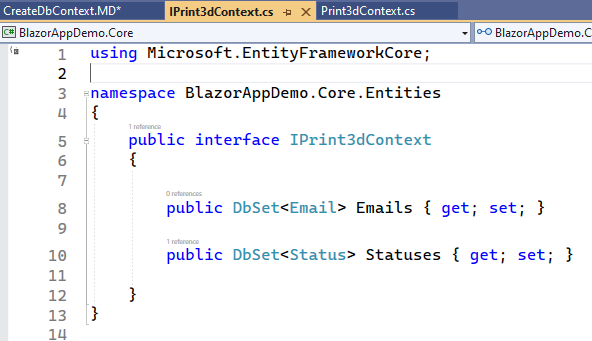

## Create the DbContext

1. Inside of **BlazorAppDemo.Infrastructure** add an empty class titles "Print3dContext"

2. Inside the **BlazorAppDemo.Core.Entities** add an empty Interface class 
titled "IPrint3dContext.cs"

3. Change <br/>
`internal interface IPrint3dContext` <br/>
to </br>
`public interface IPrint3dContext`

4.  Add the following getters and setters for our two entities

```
    public interface IPrint3dContext
    {

        public DbSet<Email> Emails { get; set; }

        public DbSet<Status> Statuses { get; set; }

    }
```




5. In **BlazorAppDemo.Infrastructure** create a new directory titled "Repositories"

6. In the new Repositories directory create a new empty class titled "Print3dContext.cs" 
This file implements the Interface you just created and also defines the 
relationships between tables.

7. Copy the code below to create the inital setup of the file.

```
using Microsoft.EntityFrameworkCore;
using BlazorAppDemo.Core.Entities;


namespace BlazorAppDemo.Infrastructure.Repositories;

public class Print3dContext : DbContext, IPrint3dContext
{
    public DbSet<Email> Emails { get; set; }

    public DbSet<Status> Statuses { get; set; }

   
}
```

8. Now add the DbContextOptions below the getters and setters. We don't 
actually have any in this project but you will likely need some in 
future projects.

```
 public Print3dContext(DbContextOptions options) : base(options)
    {

    }

```

9. Now we define the relationships between tables (entities) inside of
the **OnModelCreating** method. 
a. The Email table has no FK relationships so we simply define the table and indicate the
primary key
b. The Status table has a FK relationship with Email. So we define the FK relationship
along with the primary key

```
    protected override void OnModelCreating(ModelBuilder modelBuilder)
    {

        modelBuilder.Entity<Email>(ent =>
        {
            ent.ToTable("Email");
            ent.HasKey(e => e.EmailId);
        });


        modelBuilder.Entity<Status>(ent => {
            ent.ToTable("Status");
            ent.HasOne(e => e.Email).WithMany(e => e.Statuses).HasForeignKey(e => e.EmailId);
            ent.HasKey(e => e.StatusId);
        });


    }
```

10. The complete Print3dContext.cs file is defined below.
```
using Microsoft.EntityFrameworkCore;
using BlazorAppDemo.Core.Entities;


namespace BlazorAppDemo.Infrastructure.Repositories;

public class Print3dContext : DbContext, IPrint3dContext
{
    public DbSet<Email> Emails { get; set; }

    public DbSet<Status> Statuses { get; set; }

    public Print3dContext(DbContextOptions options) : base(options)
    {

    }

    protected override void OnModelCreating(ModelBuilder modelBuilder)
    {

        modelBuilder.Entity<Email>(ent =>
        {
            ent.ToTable("Email");
            ent.HasKey(e => e.EmailId);
        });

        modelBuilder.Entity<Status>(ent => {
            ent.ToTable("Status");
            ent.HasOne(e => e.Email).WithMany(e => e.Statuses).HasForeignKey(e => e.EmailId);
            ent.HasKey(e => e.StatusId);
        });


    }

}
```


