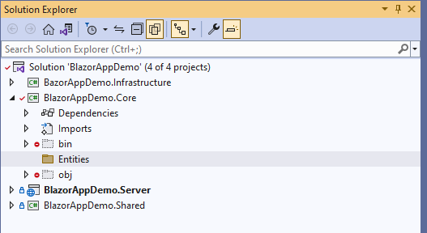
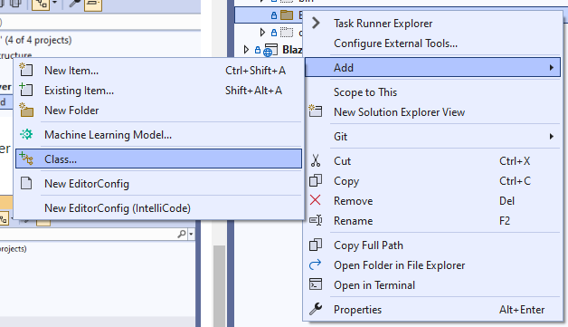
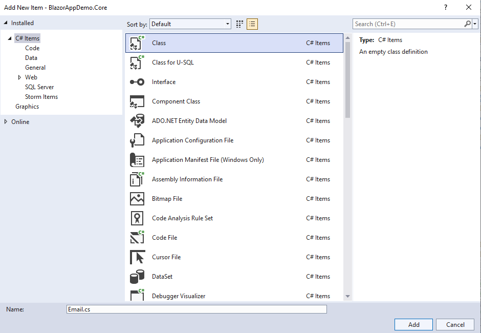
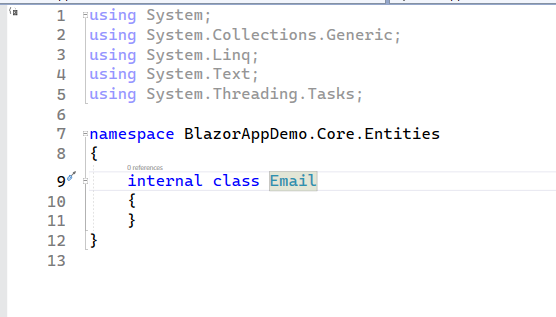
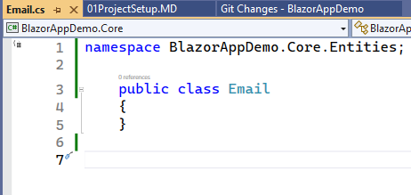
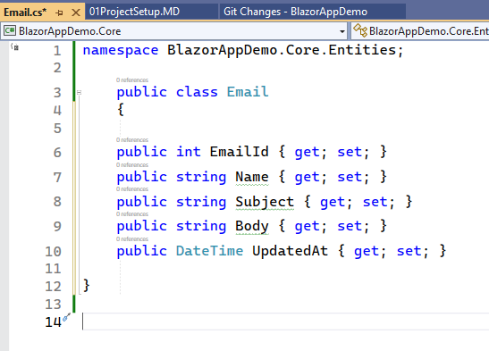
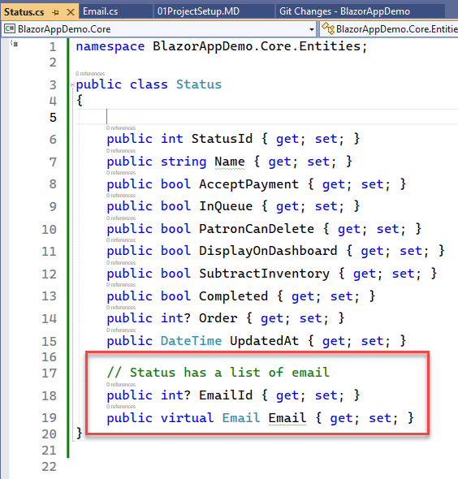
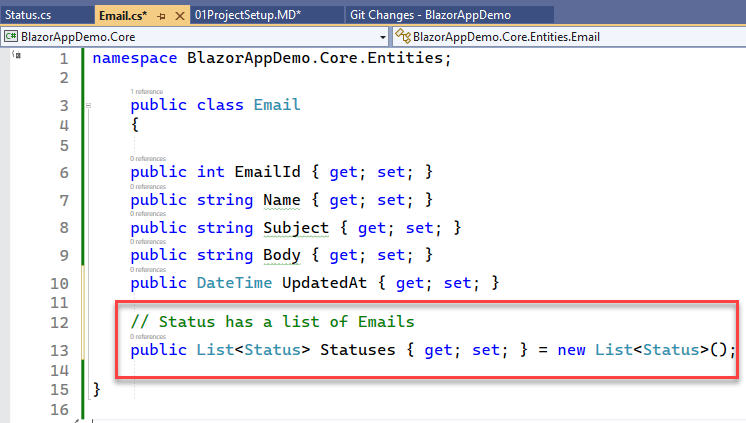

## Create Entities

1. Create a new folder in ==BlazorAppDemo.Core== called "Entities"

2. We need to create an entity class that corresponds to each 
table in our database.To do this right click on the entity folder > 
Add > New Class. Name the class ==Email.cs==

3. The initial class looks like the image below. 

4. Change the class as follows.
a. Remove the curly braces that correspond to the namespace and place
a semicolon after ==BlazorAppDemo.Core.Entities==
b. The using statements are greyed out which means they are not necessary. 
Right click on one of the using statemens and select 
Quick Actions and Refactorings > Suppress Unnecessary Usings.
c. Change ==internal class Email== to ==public class Email==

5. Add the getters and setters for each column in the table. 
Make sure the datatypes match the datatypes in the corresponding
table.

6. There is a foreign key relationship between the Email and Status
table. Let's create the Status entity, and the relationship
between the two tables. To create a foreign key relationship.
a. Add the reference to the FK
b. Add a reference to the table holding the FK as shown in the
red box.

7. Go back to the Email entity and had the relationship
pointing to the Status entity.

