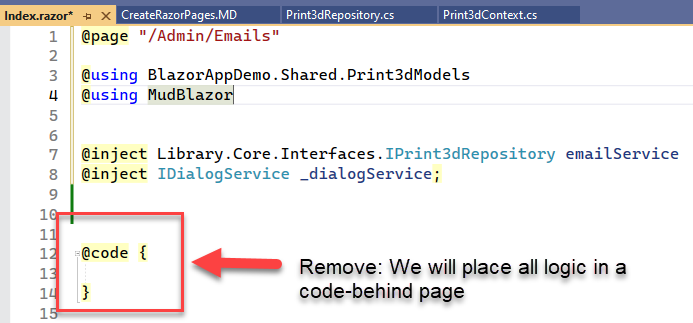
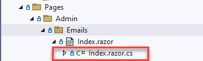
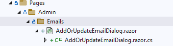

## Create Razor Component (Web Templates)

 
Razor components allow you to populate web templates dynamically with data. They
also support using The MudBlazor component library to format your pages
using C# instead of JavaScript.

### Create the Directory Structure

1. Under the main project, **BlazorAppDemo.Server** there is a directory
created by default titled **Pages**. Delete the following default pages
that are created initially with the project.
* "Counter.razor"
* "FetchData.razor"

2. Under **BlazorAppDemo.Server/Pages** create two sub-directories
* "Admin" - for administrative pages
* "Public" - for public facing pages

3. Under **BlazorAppDemo.Server/Pages/Admin** create a sub-directory 
for each entity in your database. We will start with "Emails" and
"Statuses" The directory structure should now look like the image below.


### Create the Master or List Page 

4. Our first razor component will contain a list of Emails. Right click on
the **Pages/Admin/Emails** folder > Add > **Razor Component** (NOT razor page) <br/>
Name the page "Index.Razor"

5. Let's initialze the page:
a. `@page "/Admin/Emails"` - the page directive
b. `@using BlazorAppDemo.Shared.Print3dModels` - path to Models we will use on this page
c. `@using MudBlazor` - Include the MudBlazor NuGet package we installed earlier. 
 This is necessary in order to use MudBlazor templates.
d. `@inject BlazorAppDemo.Core.Interfaces.IPrint3dRepository emailService` - Inject the
 **Print3dRepository** so you can access the database functions.
e. `@inject IDialogService _dialogService;` - the **IDialogService is a .net class
that we use to pass data between the index and detail page in a master-detail relationship.
 It is used in conjuction the a MudBlazor dialog box.
d. Remove the **@code block**. We will instead code in a "code behind" file.

Here is the complete code block.
```
@page "/Admin/Emails

@using BlazorAppDemo.Shared.Print3dModels
@using MudBlazor

@inject BlazorAppDemo.Core.Interfaces.IPrint3dRepository emailService
@inject IDialogService _dialogService
```




6. To create the code behind page, right click on the **Pages > Admin > Emails**
 click Add > Class > name the code behind page the same name as the razor page
 but with ".cs" appended to it. So name the file "Index.razor.cs". You will notice
 the code behind page shows up as a child of "Index.razor".

 

 7. Add the follwing using statements to the top of the file
```
using BlazorAppDemo.Core.Interfaces;
using BlazorAppDemo.Shared.Print3dModels;
using Microsoft.AspNetCore.Components;
using MudBlazor;
```

 8. Change "**public class Index**" to "**public partial class Index**".

 9. Inside `public partial class Index` <br/>
 **Inject** the service to access the functions listed in **IPrint3dRepository**

 ```
 [Inject] private IPrint3dRepository DataService { get; set; }
 ```

 10. Create a list of EmailModels and give the list a name.

 ```
 public List<EmailModel> AllEmails { get; set; }
 ```

 11. Create a variable to hold error messages in case our database calls fail.
 ```
 public string SaveError { get; set; }
 ```

 12. Create an **OnInitializedAsync()** function that runs when the page first loads. 
 Inside this function, we want to get a list of all records from the **Email** table. We
 place our database call inside of a try catch block. If the database call fails,
 the exception will be raised and populate the **SaveError** variable.
 
 ```
    protected override async Task OnInitializedAsync()
    {
        try
        {
            AllEmails = await DataService.GetEmails();
        }
        catch (Exception ex)
        {
            SaveError = $"Error retreiving Emails{ex.Message}";
          
        }
    }
```
13. Create empty tasks for Create, Update, and Delete Email.

```
    protected async Task CreateEmailAsync()
    {
    }

    protected async Task UpdateEmailAsync(int emailId)
    {
    }

    protected async Task DeleteEmailAsync(int emailId)
    {
    }

```

14. The  **Index.razor.cs** full-code to this point is below.

```
using BlazorAppDemo.Core.Interfaces;
using BlazorAppDemo.Shared.Print3dModels;
using Microsoft.AspNetCore.Components;
using MudBlazor;

namespace BlazorAppDemo.Server.Pages.Admin.Emails;

public partial class Index
{

    [Inject] private IPrint3dRepository DataService { get; set; }
    public List<EmailModel> AllEmails { get; set; }
    public string SaveError { get; set; }

    protected override async Task OnInitializedAsync()
    {
        try
        {
            AllEmails = await DataService.GetEmails();
        }
        catch (Exception ex)
        {
            SaveError = $"Error retreiving Emails{ex.Message}";

        }
    }

    protected async Task CreateEmailAsync()
    {
    }

    protected async Task UpdateEmailAsync(int EmailId)
    {
    }

    protected async Task DeleteEmailAsync(int EmailId)
    {
    }

 }
 ```

  15. Return to **Index.razor**. We now begin adding MudBlazor components. 
 Create a button by adding a **MudContainer class** and **MudFab** component
 a. This button will call the CreateEmailAsync function. The logic for this function
 is contained in the Index.razor.cs code behind file and is associated with the
 **@onclick** event.

 ```
 <MudContainer Class="d-flex justify-center mb-2">
    <MudFab Color="MudBlazor.Color.Primary" StartIcon="@Icons.Material.Filled.Add" Size="Size.Large" IconSize="Size.Large" Label="Add A New
    Email" Class="ma-2" @onclick="(e => CreateEmailAsync())" />
</MudContainer>
```

16. Create a table to hold a list of emails.
```
<MudTable Class="pa-10" Items="@AllEmails">
    <ToolBarContent>
        <MudText Typo="Typo.h6">Emails</MudText>
        <MudSpacer />
    </ToolBarContent>
    <HeaderContent>
        <MudTh Class="mlr-2">>EmailId</MudTh>
        <MudTh Class="mlr-2">Name</MudTh>
        <MudTh Class="mlr-2" >Subject</MudTh>
        <MudTh Class="mlr-2">Body</MudTh>
        <MudTh Class="mlr-2">Update</MudTh>
        <MudTh Class="mlr-2">Delete</MudTh>
    </HeaderContent>
    <RowTemplate>
        <MudTd DataLabel="Email#">@context.EmailId</MudTd>
        <MudTd DataLabel="Name">@context.Name</MudTd>
        <MudTd DataLabel="Subject">@context.Subject</MudTd>
        <MudTd DataLabel="Body">@context.Body</MudTd>

        <MudTd Datalabel="">
            <MudFab @onclick="@(()=>UpdateEmailAsync(@context.EmailId))" StartIcon="@Icons.Material.Filled.Edit" Color="MudBlazor.Color.Primary">
            </MudFab>
        </MudTd>
        <MudTd Datalabel="">
            <MudFab @onclick="@(()=>DeleteEmailAsync(@context.EmailId))" StartIcon="@Icons.Material.Filled.Delete" Color="MudBlazor.Color.Error">
            </MudFab>
        </MudTd>
    </RowTemplate>
    <PagerContent>
        <MudTablePager />
    </PagerContent>
</MudTable>
```
17. Create a **MudAlert** component to hold any error messages thrown during the rendering of this page.

```
@if (!string.IsNullOrEmpty(SaveError))
{
    <MudAlert Severity="Severity.Error" Class="mt-2" ShowCloseIcon="true" CloseIconClicked="() => { SaveError = string.Empty; }">
        @SaveError
    </MudAlert>
}
```

18. Here is the complete code for the **Index.razor** page as it now stands
```
@page "/Admin/Emails"

@using BlazorAppDemo.Shared.Print3dModels
@using MudBlazor


@inject BlazorAppDemo.Core.Interfaces.IPrint3dRepository emailService
@inject IDialogService _dialogService;


<MudContainer Class="d-flex justify-center mb-2">
    <MudFab Color="MudBlazor.Color.Primary" StartIcon="@Icons.Material.Filled.Add" Size="Size.Large" IconSize="Size.Large" Label="Add A New
   Email" Class="ma-2" @onclick="(e => CreateEmailAsync())" />
</MudContainer>

<MudTable Class="pa-10" Items="@AllEmails">
    <ToolBarContent>
        <MudText Typo="Typo.h6">Emails</MudText>
        <MudSpacer />
    </ToolBarContent>
    <HeaderContent>
        <MudTh Class="mlr-2">>EmailId</MudTh>
        <MudTh Class="mlr-2">Name</MudTh>
        <MudTh Class="mlr-2">Subject</MudTh>
        <MudTh Class="mlr-2">Body</MudTh>
        <MudTh Class="mlr-2">Update</MudTh>
        <MudTh Class="mlr-2">Delete</MudTh>
    </HeaderContent>
    <RowTemplate>
        <MudTd DataLabel="Email#">@context.EmailId</MudTd>
        <MudTd DataLabel="Name">@context.Name</MudTd>
        <MudTd DataLabel="Subject">@context.Subject</MudTd>
        <MudTd DataLabel="Body">@context.Body</MudTd>

        <MudTd Datalabel="">
            <MudFab @onclick="@(()=>UpdateEmailAsync(@context.EmailId))" StartIcon="@Icons.Material.Filled.Edit" Color="MudBlazor.Color.Primary">
            </MudFab>
        </MudTd>
        <MudTd Datalabel="">
            <MudFab @onclick="@(()=>DeleteEmailAsync(@context.EmailId))" StartIcon="@Icons.Material.Filled.Delete" Color="MudBlazor.Color.Error">
            </MudFab>
        </MudTd>
    </RowTemplate>
    <PagerContent>
        <MudTablePager />
    </PagerContent>
</MudTable>

@if (!string.IsNullOrEmpty(SaveError))
{
    <MudAlert Severity="Severity.Error" Class="mt-2" ShowCloseIcon="true" CloseIconClicked="() => { SaveError = string.Empty; }">
        @SaveError
    </MudAlert>
}
```
19. Now create two new files for edits and updates. A razor component titled, "AddOrUpdateEmailDialog.razor" and
a code-behind titled "AddOrUpdateEmailDialog.razor.cs". We will add the
code for these files later. 




20. Return to **Index.razor.cs**
 
20. Add the lines below to **CreateEmailAsync()**.
a. Instantiate a variable to hold parameters that will be passed to the MudDialog form
that will be used to create a new Email.
b. Add an instance of an emtpy EmailModel to parameters.
c. Pass the parameters to **AddOrUpdateEmailDialog.razor** template and show the template.

```
    var parameters = new DialogParameters();
    parameters.Add("emailModel", new EmailModel());
    var dialog = await _dialogService.Show<AddOrUpdateEmailDialog>("Create A New Email Entry", parameters).Result;
```
21. After the new Email is added and the MudDialog box is closed, we want to re-run our
search of all Emails so our new Email will show up in the list. Append the code
below to the **CreateEmailAsync()** function. This code re-executes the
query to get a list of Emails and re-populate the grid.
```
        try
        {
            AllEmails = await DataService.GetEmails();
        }
        catch (Exception ex)
        {
            SaveError = $"Error retreiving Emails{ex.Message}";
        }
```

22. Add the lines below to **UpdateEmailAsync()**.
a. Instantiate a variable to hold parameters that will be passed to the MudDialog form
b. Populate the **emailNeedToUpdate** variable with the record matching the emailId
that was passed into the function.
c. Add an instance of an EmailModel to parameters with the record retreived on line 2.
d. Pass the parameters to **AddOrUpdateEmailDialog.razor** template and render the template.


```
    var parameters = new DialogParameters();
    var emailNeedToUpdate = AllEmails.FirstOrDefault(_ => _.EmailId ** EmailId);
    parameters.Add("emailModel", emailNeedToUpdate);
    var dialog = await _dialogService.Show<AddOrUpdateEmailDialog>("Update A Email", parameters).Result;
```

23. After the new Email is updated and the MudDialog box is closed, we want to re-run our
search of all Emails so changes made to the modified Email will show up in the list. Append 
the code below **UpdateEmailAsync()** to re-execute the
query to get a list of Emails and re-populate the grid.
```
        try
        {
            AllEmails = await DataService.GetEmails();
        }
        catch (Exception ex)
        {
            SaveError = $"Error retreiving Emails{ex.Message}";
        }
```

24. Add the lines below to **DeleteEmailAsync(int EmailId)**.<br/>
Instantiate a boolean nullable variable that contains a message box passed
to the dialog service. This give the user the opportunity to confirm or cancel
the deletion of the Email record.
```
  bool? result = await _dialogService.ShowMessageBox(
  "Delete Confirmation",
  "Deleting can not be undone!",
  yesText: "Delete!", cancelText: "Cancel");
```
25. Append the code below to **DeleteEmailAsync(int EmailId)** to test the 
value of the result to see if it is null. If result is not null execute the 
delete function in a try/catch statement.
```
if (result ?? false)
{
    try
    {
        await DataService.DeleteEmailAsync(EmailId);
        AllEmails = await DataService.GetEmails();
    }
    catch (Exception ex)
    {
        SaveError = "You cannot delete this coupon. It is attached to a job";
    }
}
```
26. The complete code to this point for **Index.razor.cs** 
is shown below.
```
using BlazorAppDemo.Core.Interfaces;
using BlazorAppDemo.Shared.Print3dModels;
using Microsoft.AspNetCore.Components;
using MudBlazor;

namespace BlazorAppDemo.Server.Pages.Admin.Emails;

public partial class Index
{

    [Inject] private IPrint3dRepository DataService { get; set; }
    public List<EmailModel> AllEmails { get; set; }
    public string SaveError { get; set; }

    protected override async Task OnInitializedAsync()
    {
        try
        {
            AllEmails = await DataService.GetEmails();
        }
        catch (Exception ex)
        {
            SaveError = $"Error retreiving Emails{ex.Message}";

        }
    }

    protected async Task CreateEmailAsync()
    {
        var parameters = new DialogParameters();
        parameters.Add("emailModel", new EmailModel());
        var dialog = await _dialogService.Show<AddOrUpdateEmailDialog>("Create A New Email Entry", parameters).Result;

        try
        {
            AllEmails = await DataService.GetEmails();
        }
        catch (Exception ex)
        {
            SaveError = $"Error retreiving Emails{ex.Message}";
        }

    }

    protected async Task UpdateEmailAsync(int EmailId)
    {
        var parameters = new DialogParameters();
        var emailNeedToUpdate = AllEmails.FirstOrDefault(_ => _.EmailId == EmailId);
        parameters.Add("emailModel", emailNeedToUpdate);
        var dialog = await _dialogService.Show<AddOrUpdateEmailDialog>("Update A Email", parameters).Result;

        try
        {
            AllEmails = await DataService.GetEmails();
        }
        catch (Exception ex)
        {
            SaveError = $"Error retreiving Emails{ex.Message}";
        }
    }

    protected async Task DeleteEmailAsync(int EmailId)
    {
        bool? result = await _dialogService.ShowMessageBox(
        "Delete Confirmation",
        "Deleting can not be undone!",
        yesText: "Delete!", cancelText: "Cancel");

        if (result ?? false)
        {
            try
            {
                await DataService.DeleteEmailAsync(EmailId);
                AllEmails = await DataService.GetEmails();
            }
            catch (Exception ex)
            {
                SaveError = "You cannot delete this coupon. It is attached to a job";
            }
        }
    }
}
```
### Code Out the AddOrUpdateEmailDialog.razor Component
1. Open **BlazorAppDemo.Server.Pages.Admin.Emails.AddOrUpdateEmailDialog.razor**

2. Add the MudDialog as shown below.
```
@using BlazorAppDemo.Core.Entities
@using BlazorAppDemo.Core.Interfaces
@using MudBlazor

<MudDialog>
    <DialogContent>
        <MudTextField T="string" Label="Name" @bind-Value="emailModel.Name" />
        <MudTextField T="string" Label="Subject" @bind-Value="emailModel.Subject" Lines="3" />
        <MudTextField T="string" Label="Body" @bind-Value="emailModel.Body" Lines="3" />
    </DialogContent>
    <DialogActions>
        <MudButton OnClick="Cancel">Cancel</MudButton>
        <MudButton Color="MudBlazor.Color.Primary" OnClick="Submit">Ok</MudButton>
    </DialogActions>
</MudDialog>

@if (!string.IsNullOrEmpty(SaveError))
{
    <MudAlert Severity="Severity.Error" Class="mt-2" ShowCloseIcon="true" CloseIconClicked="() => { SaveError = string.Empty; }">
        @SaveError
    </MudAlert>
}
```
* Values from the **emailModel** are bound to **MudTextFields** using **@bind-Value
* The logic for the **OnClick** events will be added to the code-behind
* A **MudAlert** is added to display any errors

3. Open the code-behind file **BlazorAppDemo.Server.Pages.Admin.Emails.AddOrUpdateEmailDialog.razor.cs**
 and add the following lines.
 ```
using BlazorAppDemo.Core.Interfaces;
using BlazorAppDemo.Shared.Print3dModels;
using Microsoft.AspNetCore.Components;
using MudBlazor;

namespace BlazorAppDemo.Server.Pages.Admin.Emails;

public partial class AddOrUpdateEmailDialog
{
    [CascadingParameter] MudDialogInstance MudDialog { get; set; }

    [Parameter] public EmailModel emailModel { get; set; } = new EmailModel();

    [Inject] private IPrint3dRepository DataService { get; set; }

    public string SaveError { get; set; }

}
```
* The class signature should be **public partial class AddOrUpdateEmailDialog**
* We instantiate a **CascadingParameter** of **MudDialogInstance** because this page
 is a child of **Index.razor**. 
* We instantiate an instance of an EmailModel to hold the data for a single record.
* We inject the **Iprint3dRepository DataService** so that we have access to 
database calls.
* We instantiate the **SaveError** variable to hold any errors that my occur.

4. Add logic for the **Cancel()** function
```
private void Cancel()
{
    MudDialog.Cancel();
}
```
* The function is **void** because it does not return a value
* We access the built in method of MudDialog to cancel the operation and
close the Dialog box.

5. Add logic for the **Submit()** function. The **Submit()** function
handles both inserts and updates.

```
protected async Task Submit()
{
    var dialog = DialogResult.Ok<EmailModel>(emailModel);
    EmailModel emailMod = dialog.Data as EmailModel;

}
```
* The **DialogResult** is a MudBlazor class.
* The **emailMod** variable is populated from the data captured in **dialog.Data**
 and is an instance of an **EmailModel**

```
 if (emailModel.EmailId == 0)
        {
            try
            {
                await DataService.CreateEmailAsync(emailMod);
                MudDialog.Close();
            }
            catch (Exception ex)
            {
                SaveError = $"Error creating Email:{ex.Message}";
            }

        } else
        {
            try
            {
                await DataService.UpdateEmailAsync(emailMod);
                MudDialog.Close();
            }

            catch (Exception ex)
            {
                SaveError = $"Error updating Email:{ex.Message}";
            }

        }
                
```
* If EmailId does **not exist** call the Create function. If that call fails, 
catch and display the error message. 
* If EmailId **does exist**, then call the Update function. If that call fails, 
catch and display the error message.

Below is the complete code for the page.
```
using BlazorAppDemo.Core.Interfaces;
using BlazorAppDemo.Shared.Print3dModels;
using Microsoft.AspNetCore.Components;
using MudBlazor;

namespace BlazorAppDemo.Server.Pages.Admin.Emails;

public partial class AddOrUpdateEmailDialog
{
    [CascadingParameter] MudDialogInstance MudDialog { get; set; }

    [Parameter] public EmailModel emailModel { get; set; } = new EmailModel();

    [Inject] private IPrint3dRepository DataService { get; set; }

    public string SaveError { get; set; }

    private void Cancel()
    {
        MudDialog.Cancel();
    }

    protected async Task Submit()
    {
    var dialog = DialogResult.Ok<EmailModel>(emailModel);
    EmailModel emailMod = dialog.Data as EmailModel;

     if (emailModel.EmailId == 0)
        {
            try
            {
                await DataService.CreateEmailAsync(emailMod);
                MudDialog.Close();
            }
            catch (Exception ex)
            {
                SaveError = $"Error creating Email:{ex.Message}";
            }

        } else
        {
            try
            {
                await DataService.UpdateEmailAsync(emailMod);
                MudDialog.Close();
            }

            catch (Exception ex)
            {
                SaveError = $"Error updating Email:{ex.Message}";
            }

        }

    }

}

```

 

