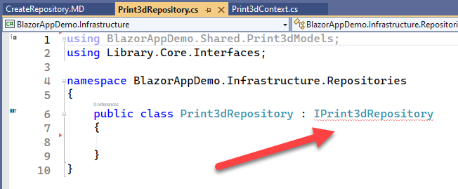
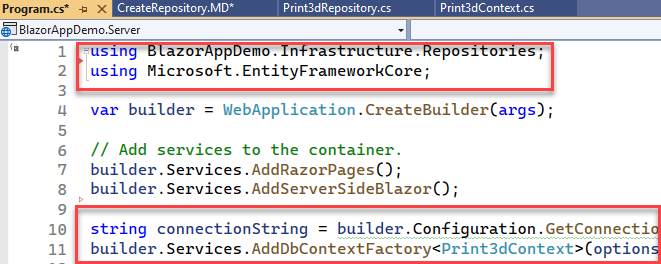

### [[Back to Index]](Index.MD)

## Creating a Repository of Database Queries

The Repository is where we manage the SQL queries that will be used in the application. 
We will create an interface class that implments the repository class.

1. Right click on the **BlazorAppDemo.Core** class library > Add > New Folder <br/>
Name the directory "Interfaces"

2. Right click on the **Interfaces** folder > Add > Class<br/>
Add a new Interface Class titled "IPrint3dRepository"

3. Populate the interface class with the CRUD function signatures that you will use for each Model
in your project as shown below.

```
using BlazorAppDemo.Shared.Print3dModels;

namespace BlazorAppDemo.Core.Interfaces;

public interface IPrint3dRepository
{
    // Emails
    Task<List<EmailModel>> GetEmails();

    Task CreateEmailAsync(EmailModel emailModel);

    Task UpdateEmailAsync(EmailModel emailModel);

    Task DeleteEmailAsync(int emailId);

    // Statuses
    Task<List<StatusModel>> GetStatuses();

    Task<List<StatusModel>> GetStatusesByEmailId(int emailId);

    Task CreateStatusAsync(StatusModel statusModel);

    Task UpdateStatusAsync(StatusModel statusModel);

    Task DeleteStatusAsync(int machineId);

}
```
2. Right click on **BlazorAppDemo.Infrastructure** Add > New Folder 
> Name the folder "Repositories" <br/>
Right click on the **Repositories** folder > Add > Class > Name the
class Print3dRepository.cs

3. Scaffold the class as shown below.

```
using BlazorAppDemo.Shared.Print3dModels;
using Library.Core.Interfaces;

namespace BlazorAppDemo.Infrastructure.Repositories
{
    public class Print3dRepository : IPrint3dRepository
    {
       
    }
}
```

4. Notice that **IPrint3dRepository** is underlined in red. Right click
on the word and select > Quick Actions and Refactoring > Implement Interface



5. The system will find all of the functions defined in IPrint3dRepository
and generate code snippetts for each one as show below.

```
using BlazorAppDemo.Shared.Print3dModels;
using Library.Core.Interfaces;

namespace BlazorAppDemo.Infrastructure.Repositories
{
    public class Print3dRepository : IPrint3dRepository
    {
        public Task CreateEmailAsync(EmailModel emailModel)
        {
            throw new NotImplementedException();
        }

        public Task CreateStatusAsync(StatusModel statusModel)
        {
            throw new NotImplementedException();
        }

        public Task DeleteEmailAsync(int emailId)
        {
            throw new NotImplementedException();
        }

        public Task DeleteStatusAsync(int machineId)
        {
            throw new NotImplementedException();
        }

        public Task<List<EmailModel>> GetEmails()
        {
            throw new NotImplementedException();
        }

        public Task<List<StatusModel>> GetStatuses()
        {
            throw new NotImplementedException();
        }

        public Task<List<StatusModel>> GetStatusesByEmailId(int emailId)
        {
            throw new NotImplementedException();
        }

        public Task UpdateEmailAsync(EmailModel emailModel)
        {
            throw new NotImplementedException();
        }

        public Task UpdateStatusAsync(StatusModel statusModel)
        {
            throw new NotImplementedException();
        }
    }
}
```

6. Register the service in Program.cs by adding the following using
statements at the top of the file.
```
using BlazorAppDemo.Infrastructure.Repositories;
using Microsoft.EntityFrameworkCore;
```
Place the following lines below **CreateBuilder** as shown below. <br/>

```
string connectionString = builder.Configuration.GetConnectionString("Print3dConnectionNew");
builder.Services.AddDbContextFactory<Print3dContext>(options => options.UseSqlServer(connectionString));
```



