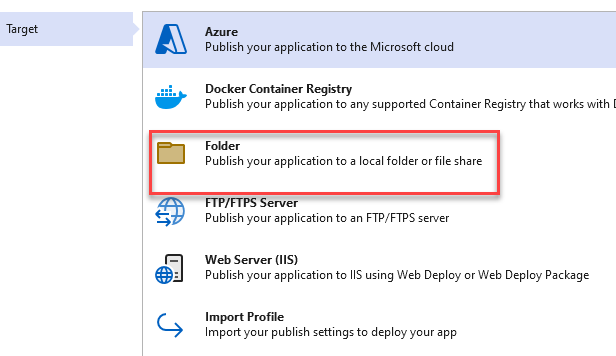
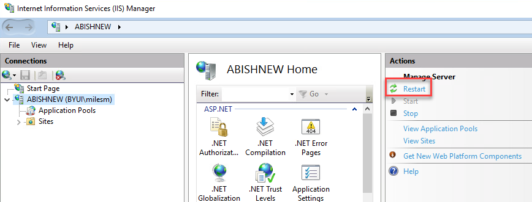

### [[Back to Index]](Index.MD)

## Deploy Application on IIS

### Publish Your Application in Visual Studio

1. Right click on your App and click "Publish"

2. Select the "Folder" Option.

3. Note the publish output location.

4. Save the publishing profile.

### SETUP IIS SERVER

1. Assuming that IIS is already install, from the Windows start go to Control Panel > 
Programs > Turn Windows features on or off

2. Select "Role Based" and click "Next"

3.Select the highlighted server and click "Next"

4. Make sure that the Application Development option for your program is installed. If
not click the appropriate box then click the "Install" button

5. Download and Install the appropriate version of the Windows Hosting Bundle.

[Link to Download.NET Hosting Bundle](https://dotnet.microsoft.com/en-us/download/dotnet/thank-you/runtime-aspnetcore-6.0.16-windows-hosting-bundle-installer)

6. Double click on hosting bundle install.

7.  Agree to terms and click "Install"

8.  Once installation completes click "Close"

9. Restart IIS

