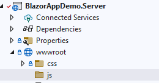
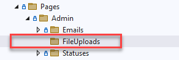

## File Upload

Implement File Upload capability using the MudFileUpload component. Also, 
implement a simple intederminant progress indicator that will display while the 
file uploads.

### This tutorial implements file loading with the following conditions
* The file will be uploaded to a location on the webserver
* The path to the file will be stored in an entity with information about the
file including the filepath.

### This tutorial assumes
* A SQL table exists with a text field that can accept the file path
* The supporting model, entity, context, mapping, and validator have 
been created.
* Only one file can be loaded a time
* Only one file can be stored per database entry


### Instructions

1. Add a new folder titled **js** under **BlazorAppDemo.Server.wwwroot**



2. Add a new folder titled **submissions** under **BlazorAppDemo.Server.wwwroot**. This 
directory will hold the file submissions

3. Add a new file title **scripts.js** in the **js** folder with the following code.
```
window.triggerFileDownload = (fileName, url) => {
    const anchorElement = document.createElement('a');
    anchorElement.href = url;
    anchorElement.download = fileName ?? '';
    anchorElement.click();
    anchorElement.remove();
}
```

4. Create a new folder in **BlazorAppDemo.Server.Pages.Admin** titled "FileUploads"



5. Create a new razor component titled "Index.razor" and populate the header.

```
@page "/Admin/FileUploads"

@using BlazorAppDemo.Core.Entities
@using BlazorAppDemo.Shared.Print3dModels

@inject BlazorAppDemo.Core.Interfaces.IPrint3dRepository FileUploadService
@using MudBlazor
@inject IDialogService _dialogService;
```


6. Add a code-behind for **Index.razor** titled **Index.razor.cs** and populate the header.
```
using BlazorAppDemo.Core.Interfaces;
using BlazorAppDemo.Shared.Print3dModels;
using Microsoft.AspNetCore.Components;
using MudBlazor;

namespace BlazorAppDemo.Server.Pages.Admin.FileUploads;

public partial class Index
{

    [Inject] private IPrint3dRepository DataService { get; set; }
    public List<FileUploadModel> AllFileUploads { get; set; }
    public string SaveError { get; set; }

}
```
7. Create a razor component titled **AddOrUpdateFileUploadDialog.razor** in
****BlazorAppDemo.Server.wwwroot**** and populate the header.
```
@using BlazorAppDemo.Core.Interfaces;
@using BlazorAppDemo.Shared.Print3dModels;
@using Microsoft.AspNetCore.Components;
@using MudBlazor;

@inject IWebHostEnvironment env
@inject IJSRuntime JS
```
* Most of these using statements are familiar but we have introduced
 two new statements because we will need to interact with the JavaScript
 file we created earlier on the razor component.

8. Add a code-behind for **AddOrUpdateFileUploadDialog.razor** titled 
**AddOrUpdateFileUploadDialog.razor.cs** and populate the header.
```
using BlazorAppDemo.Core.Interfaces;
using BlazorAppDemo.Shared.Print3dModels;
using Microsoft.AspNetCore.Components;
using Microsoft.AspNetCore.Components.Forms;
using Microsoft.JSInterop;
using MudBlazor;


namespace BlazorAppDemo.Server.Pages.Admin.FileUploads;
```

9. Add the **OnInitializedAsync()** function
```
    protected override async Task OnInitializedAsync()
    {
        try
        {
            AllFileUploads = await DataService.GetFileUploadsAsync();
        }
        catch (Exception ex)
        {
            SaveError = $"Error retreiving Emails{ex.Message}";

        }
    }

```
10. Add the calls to the CRUD operations. 
```
    protected async Task CreateFileUploadAsync()
    {
        var parameters = new DialogParameters();
        parameters.Add("fileUploadModel", new FileUploadModel());
        var dialog = await _dialogService.Show<AddOrUpdateFileUploadDialog>("Create A New File Entry", parameters).Result;

        try
        {
            AllFileUploads = await DataService.GetFileUploadsAsync();
        }
        catch (Exception ex)
        {
            SaveError = $"Error retreiving Emails{ex.Message}";
        }

    }

    protected async Task UpdateFileUploadAsync(int fileUploadId)
    {
        var parameters = new DialogParameters();
        var fileUploadNeedToUpdate = AllFileUploads.FirstOrDefault(_ => _.FileUploadId == fileUploadId);

        parameters.Add("fileUploadModel", fileUploadNeedToUpdate);
        var dialog = await _dialogService.Show<AddOrUpdateFileUploadDialog>("Update A File", parameters).Result;

        try
        {
            AllFileUploads = await DataService.GetFileUploadsAsync();
        }
        catch (Exception ex)
        {
            SaveError = $"Error retreiving Emails{ex.Message}";
        }
    }

    protected async Task DeleteFileUploadAsync(int fileUploadId)
    {
        bool? result = await _dialogService.ShowMessageBox(
        "Delete Confirmation",
        "Deleting can not be undone!",
        yesText: "Delete!", cancelText: "Cancel");

        if (result ?? false)
        {
            try
            {
                await DataService.DeleteFileUploadAsync(fileUploadId);
                AllFileUploads = await DataService.GetFileUploadsAsync();
            }
            catch (Exception ex)
            {
                SaveError = "You cannot delete this file.";
            }
        }
    }
```
11. Below is the complete Code for **BlazorAppDemo.Server.Pages.Admin.Index.razor.cs
```
using BlazorAppDemo.Core.Interfaces;
using BlazorAppDemo.Shared.Print3dModels;
using Microsoft.AspNetCore.Components;
using MudBlazor;

namespace BlazorAppDemo.Server.Pages.Admin.FileUploads;

public partial class Index
{

    [Inject] private IPrint3dRepository DataService { get; set; }
    public List<FileUploadModel> AllFileUploads { get; set; }
    public string SaveError { get; set; }


    protected override async Task OnInitializedAsync()
    {
        try
        {
            AllFileUploads = await DataService.GetFileUploadsAsync();
        }
        catch (Exception ex)
        {
            SaveError = $"Error retreiving Emails{ex.Message}";

        }
    }

    protected async Task CreateFileUploadAsync()
    {
        var parameters = new DialogParameters();
        parameters.Add("fileUploadModel", new FileUploadModel());
        var dialog = await _dialogService.Show<AddOrUpdateFileUploadDialog>("Create A New File Entry", parameters).Result;

        try
        {
            AllFileUploads = await DataService.GetFileUploadsAsync();
        }
        catch (Exception ex)
        {
            SaveError = $"Error retreiving Emails{ex.Message}";
        }

    }

    protected async Task UpdateFileUploadAsync(int fileUploadId)
    {
        var parameters = new DialogParameters();
        var fileUploadNeedToUpdate = AllFileUploads.FirstOrDefault(_ => _.FileUploadId == fileUploadId);

        parameters.Add("fileUploadModel", fileUploadNeedToUpdate);
        var dialog = await _dialogService.Show<AddOrUpdateFileUploadDialog>("Update A File", parameters).Result;

        try
        {
            AllFileUploads = await DataService.GetFileUploadsAsync();
        }
        catch (Exception ex)
        {
            SaveError = $"Error retreiving Emails{ex.Message}";
        }
    }

    protected async Task DeleteFileUploadAsync(int fileUploadId)
    {
        bool? result = await _dialogService.ShowMessageBox(
        "Delete Confirmation",
        "Deleting can not be undone!",
        yesText: "Delete!", cancelText: "Cancel");

        if (result ?? false)
        {
            try
            {
                await DataService.DeleteFileUploadAsync(fileUploadId);
                AllFileUploads = await DataService.GetFileUploadsAsync();
            }
            catch (Exception ex)
            {
                SaveError = "You cannot delete this file.";
            }
        }
    }
}

```
12. Edit **BlazorAppDemo.Server.Pages.Admin.Index.razor** and
 add the MudBlazor components.
 ```
 <MudContainer Class="d-flex justify-center mb-2">
    <MudFab Color="MudBlazor.Color.Primary" StartIcon="@Icons.Material.Filled.Add" Size="Size.Large" IconSize="Size.Large" Label="Add A New
   File" Class="ma-2" @onclick="(e => CreateFileUploadAsync())" />
</MudContainer>

<MudTable Class="pa-10" Items="@AllFileUploads">
    <ToolBarContent>
        <MudText Typo="Typo.h6">Files</MudText>
        <MudSpacer />
    </ToolBarContent>
    <HeaderContent>
        <MudTh Class="mlr-2">FileUploadId</MudTh>
        <MudTh Class="mlr-2">Name</MudTh>
        <MudTh Class="mlr-2">File Path</MudTh>
    </HeaderContent>
    <RowTemplate>
        <MudTd DataLabel="FileUploadId#">@context.FileUploadId</MudTd>
        <MudTd DataLabel="Name">@context.Name</MudTd>
        <MudTd DataLabel="Subject">@context.FilePath</MudTd>
       

        <MudTd Datalabel="">
            <MudFab @onclick="@(()=>UpdateFileUploadAsync(@context.FileUploadId))" StartIcon="@Icons.Material.Filled.Edit" Color="MudBlazor.Color.Primary">
            </MudFab>
        </MudTd>
        <MudTd Datalabel="">
            <MudFab @onclick="@(()=>DeleteFileUploadAsync(@context.FileUploadId))" StartIcon="@Icons.Material.Filled.Delete" Color="MudBlazor.Color.Error">
            </MudFab>
        </MudTd>
    </RowTemplate>
    <PagerContent>
        <MudTablePager />
    </PagerContent>
</MudTable>

@if (!string.IsNullOrEmpty(SaveError))
{
    <MudAlert Severity="Severity.Error" Class="mt-2" ShowCloseIcon="true" CloseIconClicked="() => { SaveError = string.Empty; }">
        @SaveError
    </MudAlert>
}
```
13. Edit **BlazorAppDemo.Server.Pages.Admin.Index.razor** and add a
 **MudDialog** component and the text field for the file name
 ```
 <MudDialog>
    <DialogContent>
        <MudTextField T="string" Label="Name" @bind-Value="fileUploadModel.Name" />
    </DialogContent>
 </MudDialog>
```
14. Add the MudProgress bar
```
        @if (ShowProgressBar == true)
        {
            <MudProgressCircular Color="MudBlazor.Color.Primary" Size="Size.Large" Indeterminate="true" />
            <MudPaper>Loading file...</MudPaper>
        }
```
* ShowProgressBar variable is instantiated on the code-behind file. It initialized as false.
 Once the event handler for uploading a file is entered and a file is selected, it get set to
 true. Once the file upload is complete, it is set to false.

15.  Add a MudPaper class to hold the file upload button and text field to hold 
the file path.
```
<MudPaper Class="d-flex align-content-start flex-wrap flex-grow-1 gap-4" Elevation="0">

    <MudFileUpload T="IBrowserFile" Accept=".png, jpg, gif, docx, xlsx, txt, csv" OnFilesChanged="OnInputFileChange">
        <ButtonTemplate>
            <MudButton HtmlTag="label"
                        Variant="Variant.Filled"
                        Color="MudBlazor.Color.Primary"
                        StartIcon="@Icons.Material.Filled.CloudUpload"
                        for="@context">
                Upload File
            </MudButton>
        </ButtonTemplate>
    </MudFileUpload>

</MudPaper>
```
* The type of IBrowser File on **MudFileUpload** is used when only a single file is to
be uploaded.
* **Accept** is the list of file types that are allowed. The default is to allow 
all file types.
* **OnInputFileChange** is a function that fires on the code-behind if the selected 
file changes.
* The Mudbutton sets the properties for the button.

16. Add code to conditionally show the **Download** button.
```
@if (@fileUploadModel.FilePath is not null)
{
    <MudButton HtmlTag="label"
            Variant="Variant.Filled"
            Color="MudBlazor.Color.Default"
            StartIcon="@Icons.Material.Filled.CloudDownload"
            OnClick="@(()=>DownloadFileFromURL(@fileUploadModel.FilePath))">
        Download File
    </MudButton>
```
* The conditional **@if** statement will be true and show the download button, if the
 FilePath value of the **FileUploadModel.FilePath** instance has been populated.

17. Add the DialogActions and close out the MudDialog.
 ```
 </DialogContent>
     <DialogActions>
        <MudButton OnClick="Cancel">Cancel</MudButton>
        <MudButton Color="MudBlazor.Color.Primary" OnClick="Submit">Ok</MudButton>
    </DialogActions>
</MudDialog>
 ```
18. Add the MudAlert.
```
@if (!string.IsNullOrEmpty(SaveError))
{
    <MudAlert Severity="Severity.Error" Class="mt-2" ShowCloseIcon="true" CloseIconClicked="() => { SaveError = string.Empty; }">
        @SaveError
    </MudAlert>
}
```
19. Here is the complete code for **AddOrUpdateFileUploadDialog.razor**
```
@using BlazorAppDemo.Core.Interfaces;
@using BlazorAppDemo.Shared.Print3dModels;
@using Microsoft.AspNetCore.Components;
@using MudBlazor;

@inject IWebHostEnvironment env
@inject IJSRuntime JS

<MudDialog>
    <DialogContent>
        <MudTextField T="string" Label="Name" @bind-Value="fileUploadModel.Name" />

        @if (ShowProgressBar == true)
        {
            <MudProgressCircular Color="MudBlazor.Color.Primary" Size="Size.Large" Indeterminate="true" />
            <MudPaper>Loading file...</MudPaper>
        }

        <MudTextField ReadOnly="true" Lines=2 T="string" Label="File Name:" @bind-Value="fileUploadModel.FilePath"  />

        <MudPaper Class="d-flex align-content-start flex-wrap flex-grow-1 gap-4" Elevation="0">

            <MudFileUpload T="IBrowserFile" Accept=".png, jpg, gif, docx, xlsx, txt, csv" OnFilesChanged="OnInputFileChange">
                <ButtonTemplate>
                    <MudButton HtmlTag="label"
                               Variant="Variant.Filled"
                               Color="MudBlazor.Color.Primary"
                               StartIcon="@Icons.Material.Filled.CloudUpload"
                               for="@context">
                        Upload File
                    </MudButton>
                </ButtonTemplate>
            </MudFileUpload>


            @if (@fileUploadModel.FilePath is not null)
            {
                <MudButton HtmlTag="label"
                       Variant="Variant.Filled"
                       Color="MudBlazor.Color.Default"
                       StartIcon="@Icons.Material.Filled.CloudDownload"
                       OnClick="@(()=>DownloadFileFromURL(@fileUploadModel.FilePath))">
                    Download File
                </MudButton>
            }
        </MudPaper>

    </DialogContent>
    <DialogActions>
        <MudButton OnClick="Cancel">Cancel</MudButton>
        <MudButton Color="MudBlazor.Color.Primary" OnClick="Submit">Ok</MudButton>
    </DialogActions>
</MudDialog>

@if (!string.IsNullOrEmpty(SaveError))
{
    <MudAlert Severity="Severity.Error" Class="mt-2" ShowCloseIcon="true" CloseIconClicked="() => { SaveError = string.Empty; }">
        @SaveError
    </MudAlert>
}
```
20. Create the code-behind for **AddOrUpdateFileUploadDialog.razor.cs** and
populate the header.
```
using BlazorAppDemo.Core.Interfaces;
using BlazorAppDemo.Shared.Print3dModels;
using Microsoft.AspNetCore.Components;
using Microsoft.AspNetCore.Components.Forms;
using Microsoft.JSInterop;
using MudBlazor;

namespace BlazorAppDemo.Server.Pages.Admin.FileUploads;
```
21. Change the class definition to "public partial class', instantiate the variables
add the parameters, and inject the appropriate services.
```
public partial class AddOrUpdateFileUploadDialog
{
    [CascadingParameter] MudDialogInstance MudDialog { get; set; }

    [Parameter] public FileUploadModel fileUploadModel { get; set; } = new FileUploadModel();


    [Inject] private IPrint3dRepository DataService { get; set; }
    [Inject] private NavigationManager NavigationManager { get; set; }
    [Inject] private ILogger<AddOrUpdateFileUploadDialog> Logger { get; set; }


    public string SaveError { get; set; }
    public bool FileSelected { get; set; } = false;
    public bool DisplayNoFileSelected { get; set; } = false;
    public bool ShowProgressBar { get; set; } = false;
```
22. Add the event handlers for **Cancel** and **Submit**.
```
private void Cancel()
    {
        MudDialog.Cancel();
    }

    protected async Task Submit()
    {
        var dialog = DialogResult.Ok(fileUploadModel);
        FileUploadModel? fileUploadMod = dialog.Data as FileUploadModel;

        if (fileUploadModel.FileUploadId == 0)
        {
            try
            {
                await DataService.CreateFileUploadAsync(fileUploadMod);
                MudDialog.Close();
            }
            catch (Exception ex)
            {
                SaveError = $"Error creating File:{ex.Message}";
            }

        }
        else
        {
            try
            {
                await DataService.UpdateFileUploadAsync(fileUploadMod);
                MudDialog.Close();
            }

            catch (Exception ex)
            {
                SaveError = $"Error updating File:{ex.Message}";
            }

        }

    }
```
23. Create the event handler for **OnInputFileChange**. We will break
this down section by section with comments.
```

string Message = "No file selected";
string theFileName = "";


IBrowserFile? selectedFile; // contains data of a file from an InputFile component //

private async void OnInputFileChange(InputFileChangeEventArgs e)
{

if (fileUploadModel.FilePath != null) // if file path exists, delete the path as a new one is being added//
try
{
    if (File.Exists(fileUploadModel.FilePath))
    {
        File.Delete(fileUploadModel.FilePath);
    }

}
catch (Exception ex)
{
    SaveError = $"Error deleting file:{ex.Message}";
    Logger.LogError(ex, "Error deleting file");

}


selectedFile = e.File;                              // get the file from the event argument //
FileSelected = true;                                // set to true for progress indicator display logic //
DisplayNoFileSelected = false;
Message = $"{selectedFile.Name} file selected";     // message that given file was selected //

if (selectedFile is not null)
{
ShowProgressBar = true;                             // variable to show MudProgress bar on razor component //


try
{

    Stream stream = selectedFile.OpenReadStream(250000000); // populate stream object with file. Limit size to 250 MBs //
    var fileName = $"{System.DateTime.Now.Ticks.ToString()}_{selectedFile.Name}"; // prepend the date in ticks to ensure 
                                                                                  // filename uniqueness
    var filePath = $"{env.WebRootPath}\\submissions\\";    // set the filepath to the submissions folder
    var fullPath = Path.Combine(filePath, fileName);       // add the filename to the filepath
    FileStream fs = File.Create(fullPath);                 // FileStream object reads and writes files in c#
    await stream.CopyToAsync(fs);                          // Copy the file (stream) to the FileStream object

    stream.Close();                                        // Close the stream
    fs.Close();                                            // Close the FileStream
    theFileName = fileName;                                // Populate the FilePath on the model
    fileUploadModel.FilePath = fullPath;

    Message = $"{selectedFile.Name} file uploaded to server"; // create a success message
    ShowProgressBar = false;                                  // Hide the progress bar
    this.StateHasChanged();                                   // Re-rended the component to show the changes

}

catch (Exception ex)                                    // Catch, handle and log any errors
{
    SaveError = $"Error uploading file:{ex.Message}";   
    Logger.LogError(ex, "Error uploading file");

}

}
else                                                    // Exit the handler if no file is selected
{
SaveError = $"No File Selected for Upload";
DisplayNoFileSelected = true;
}

}
```
24. Add logic for File Download.
```
private IJSObjectReference? module;                                 // Create a reference to a JavaScript object //

protected override async Task OnAfterRenderAsync(bool firstRender) // Is invoked each time the component renders
{                                                                  
    if (firstRender)
    {
        module = await JS.InvokeAsync<IJSObjectReference>("import", // Import the JavaScript file //
            "../js/scripts.js");
    }
    
private async Task DownloadFileFromURL(string fileUrl)              // get fileUrl from MudForm //
{
    if (fileUrl is not null)
    {
        try
        {
            var startFileName = fileUrl.LastIndexOf("\\");          // Find the starting position of the filename //
            var fileName = fileUrl.Substring(startFileName);        // Extract the file name from the string
            var fileURL = "\\submissions\\" + fileName;             // Add the submissions folder to the filepath
            await JS.InvokeVoidAsync("triggerFileDownload", fileName, fileURL); //

        }
        catch (Exception ex)
        {
            SaveError = $"There is no file to download:{ex.Message}";
            Logger.LogError(ex, "There is no file to download");
        }
    }
    else
    {
        SaveError = $"There is no file to download.";
    }
}

```