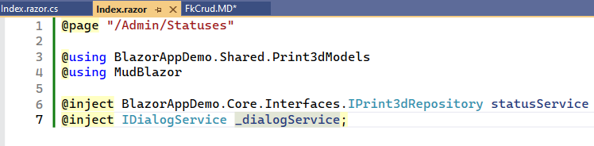
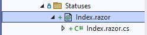
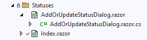

## Creating Razor Components for CRUD Operations

Razor components that handle FK relationships have the added complexity of
 associating lists of records from FK tables.

Let's review the steps we did earlier when we created the Email components.

1. Earlier we created a directory title "Statuses" under 
**BlazorAppDemo.Server.Pages.Admin**


### Create the Master or List Page 

2. Our razor component will contain a list of Statuses. Right click on
the **Pages/Admin/Emails** folder > Add > **Razor Component** (NOT razor page) <br/>
Name the page "Index.Razor"

3. Let's initialze the page:
a. `@page "/Admin/Statuses"` - the page directive
b. `@using BlazorAppDemo.Shared.Print3dModels` - path to Models we will use on this page
c. `@using MudBlazor` - Include the MudBlazor NuGet package we installed earlier. 
 This is necessary in order to use MudBlazor templates.
d. `@inject BlazorAppDemo.Core.Interfaces.IPrint3dRepository statusService` - Inject the
 **Print3dRepository** so you can access the database functions.
e. `@inject IDialogService _dialogService;` - the **IDialogService is a .net class
that we use to pass data between the index and detail page in a master-detail relationship.
 It is used in conjuction the a MudBlazor dialog box.
d. Remove the **@code block**. We will instead code in a "code behind" file.

Here is the code block.
```
@page "/Admin/Statuses"

@using BlazorAppDemo.Shared.Print3dModels
@using MudBlazor

@inject BlazorAppDemo.Core.Interfaces.IPrint3dRepository statusService
@inject IDialogService _dialogService;
```



3. To create the code behind page, right click on the **Pages > Admin > Statuses**
 directory. Then click, Add > Class > name the code behind page the same name as the razor page
 but with ".cs" appended to it. So name the file "Index.razor.cs". You will notice
 the code behind page shows up as a child of "Index.razor".



 7. Add the follwing using statements to the top of the code-behind page
```
using BlazorAppDemo.Core.Interfaces;
using BlazorAppDemo.Shared.Print3dModels;
using Microsoft.AspNetCore.Components;
using MudBlazor;
```

8. Change "**public class Index**" to "**public partial class Index**".

9. Inside `public partial class Index` <br/>
 **Inject** the service to access the functions listed in **IPrint3dRepository**

 
 ```
 [Inject] private IPrint3dRepository DataService { get; set; }
 ```

 10. Create a list of StatusModels and give the list a name.

 ```
 public List<StatusModel> AllStatuses { get; set; }
 ```

 11. Create a variable to hold error messages in case our database calls fail.
 ```
 public string SaveError { get; set; }
 ```

 12. Create an **OnInitializedAsync()** function that runs when the page first loads. 
 Inside this function, we want to get a list of all records from the **Status** table. We
 place our database call inside of a try catch block. If the database call fails,
 the exception will be raised and populate the **SaveError** variable.
 
 ```
    protected override async Task OnInitializedAsync()
    {
        try
        {
            AllStatuses = await DataService.GetStatusesAsync();
        }
        catch (Exception ex)
        {
            SaveError = $"Error retreiving Statuses{ex.Message}";
          
        }
    }
```
13. Create empty tasks for Create, Update, and Delete Status.

```
    protected async Task CreateStatusAsync()
    {
    }

    protected async Task UpdateStatusAsync(int emailId)
    {
    }

    protected async Task DeleteSTatusAsync(int emailId)
    {
    }

```

14. The  **Index.razor.cs** full-code to this point is below.

```
using BlazorAppDemo.Core.Interfaces;
using BlazorAppDemo.Shared.Print3dModels;
using Microsoft.AspNetCore.Components;
using MudBlazor;

namespace BlazorAppDemo.Server.Pages.Admin.Statuses;

public partial class Index
{

    [Inject] private IPrint3dRepository DataService { get; set; }
    public List<StatusModel> AllStatuses { get; set; }
    public string SaveError { get; set; }

    protected override async Task OnInitializedAsync()
    {
        try
        {
            AllStatuses = await DataService.GetStatusesAsync();
        }
        catch (Exception ex)
        {
            SaveError = $"Error retreiving Statuses{ex.Message}";

        }
    }

    protected async Task CreateStatusAsync()
    {
    }

    protected async Task UpdateStatusAsync(int statusId)
    {
    }

    protected async Task DeleteStatusAsync(int statusId)
    {
    }

 }
 ```
  15. Return to **Index.razor**. We now begin adding MudBlazor components. 
 Create a button by adding a **MudContainer class** and **MudFab** component
 a. This button will call the CreateStatusAsync function. The logic for this function
 is contained in the Index.razor.cs code behind file and is associated with the
 **@onclick** event.

  ```
 <MudContainer Class="d-flex justify-center mb-2">
    <MudFab Color="MudBlazor.Color.Primary" StartIcon="@Icons.Material.Filled.Add" Size="Size.Large" IconSize="Size.Large" Label="Add A New
    Email" Class="ma-2" @onclick="(e => CreateStatusAsync())" />
</MudContainer>
```
16. Create a MudTable to hold a list of Statuses.
```
<MudTable Class="pa-10" Items="@AllStatuses">
    <ToolBarContent>
        <MudText Typo="Typo.h6">Statuses</MudText>
        <MudSpacer />
    </ToolBarContent>
    <HeaderContent>
        <MudTh Class="mlr-2">Status Id</MudTh>
        <MudTh Class="mlr-2">Name</MudTh>
        <MudTh Class="mlr-2">Email Subject</MudTh>
        <MudTh Class="mlr-2">Accept Payment</MudTh>
        <MudTh Class="mlr-2">In Queue</MudTh>
        <MudTh Class="mlr-2">Patron Can Delete</MudTh>
        <MudTh Class="mlr-2">Display on Dashboard</MudTh>
        <MudTh Class="mlr-2">Subtract Inventory</MudTh>
        <MudTh Class="mlr-2">Completed</MudTh>
        <MudTh Class="mlr-2">Order</MudTh>
        <MudTh Class="mlr-2">Update</MudTh>
        <MudTh Class="mlr-2"> Delete</MudTh>
    </HeaderContent>
    <RowTemplate>
        <MudTd DataLabel="Status#">@context.StatusId</MudTd>
        <MudTd DataLabel="Name">@context.Name</MudTd>
        <MudTd DataLabel="Email ID">
            @if (@context.EmailId is null)
            {

            }
            else
            {
                @context.Email.Name
            }

        </MudTd>
        <MudTd>
            <MudCheckBox Disabled @bind-Checked="context.AcceptPayment" Size="Size.Small" Color="Color.Primary"></MudCheckBox>
        </MudTd>
        <MudTd>
            <MudCheckBox Disabled @bind-Checked="context.InQueue" Size="Size.Small" Color="Color.Primary"></MudCheckBox>
        </MudTd>
        <MudTd>
            <MudCheckBox Disabled @bind-Checked="context.PatronCanDelete" Size="Size.Small" Color="Color.Primary"></MudCheckBox>
        </MudTd>
        <MudTd>
            <MudCheckBox Disabled @bind-Checked="context.DisplayOnDashboard" Size="Size.Small" Color="Color.Primary"></MudCheckBox>
        </MudTd>
        <MudTd>
            <MudCheckBox Disabled @bind-Checked="context.SubtractInventory" Size="Size.Small" Color="Color.Primary"></MudCheckBox>
        </MudTd>
        <MudTd>
            <MudCheckBox Disabled @bind-Checked="context.Completed" Size="Size.Small" Color="Color.Primary"></MudCheckBox>
        </MudTd>
        <MudTd>
            <MudCheckBox Disabled @bind-Checked="context.Order" Size="Size.Small" Color="Color.Primary"></MudCheckBox>
        </MudTd>

        <MudTd>
            <MudFab @onclick="@(()=>UpdateStatusAsync(@context.StatusId))" StartIcon="@Icons.Material.Filled.Edit" Color="MudBlazor.Color.Primary">
            </MudFab>
        </MudTd>
        <MudTd>
            <MudFab @onclick="@(()=>DeleteStatusAsync(@context.StatusId))" StartIcon="@Icons.Material.Filled.Delete" Color="MudBlazor.Color.Error">
            </MudFab>
        </MudTd>
    </RowTemplate>
    <PagerContent>
        <MudTablePager />
    </PagerContent>
</MudTable>
```
17. Create a **MudAlert** component to hold any error messages thrown during the rendering of this page.
```
@if (!string.IsNullOrEmpty(SaveError))
{
    <MudAlert Severity="Severity.Error" Class="mt-2" ShowCloseIcon="true" CloseIconClicked="() => { SaveError = string.Empty; }">
        @SaveError
    </MudAlert>
}
```
18. Here is the complete code for the **Index.razor** page as it now stands
```
@page "/Admin/Statuses"

@using BlazorAppDemo.Shared.Print3dModels
@using MudBlazor

@inject BlazorAppDemo.Core.Interfaces.IPrint3dRepository statusService
@inject IDialogService _dialogService;

<MudContainer Class="d-flex justify-center mb-2">
    <MudFab Color="MudBlazor.Color.Primary" StartIcon="@Icons.Material.Filled.Add" Size="Size.Large" IconSize="Size.Large" Label="Add A New
    Email" Class="ma-2" @onclick="(e => CreateStatusAsync())" />
</MudContainer>

<MudTable Class="pa-10" Items="@AllStatuses">
    <ToolBarContent>
        <MudText Typo="Typo.h6">Statuses</MudText>
        <MudSpacer />
    </ToolBarContent>
    <HeaderContent>
        <MudTh Class="mlr-2">Status Id</MudTh>
        <MudTh Class="mlr-2">Name</MudTh>
        <MudTh Class="mlr-2">Email Subject</MudTh>
        <MudTh Class="mlr-2">Accept Payment</MudTh>
        <MudTh Class="mlr-2">In Queue</MudTh>
        <MudTh Class="mlr-2">Patron Can Delete</MudTh>
        <MudTh Class="mlr-2">Display on Dashboard</MudTh>
        <MudTh Class="mlr-2">Subtract Inventory</MudTh>
        <MudTh Class="mlr-2">Completed</MudTh>
        <MudTh Class="mlr-2">Order</MudTh>
        <MudTh Class="mlr-2">Update</MudTh>
        <MudTh Class="mlr-2"> Delete</MudTh>
    </HeaderContent>
    <RowTemplate>
        <MudTd DataLabel="Status#">@context.StatusId</MudTd>
        <MudTd DataLabel="Name">@context.Name</MudTd>
        <MudTd DataLabel="Email ID">
            @if (@context.EmailId is null)
            {

            }
            else
            {
                @context.Email.Name
            }

        </MudTd>
        <MudTd>
            <MudCheckBox Disabled @bind-Checked="context.AcceptPayment" Size="Size.Small" Color="Color.Primary"></MudCheckBox>
        </MudTd>
        <MudTd>
            <MudCheckBox Disabled @bind-Checked="context.InQueue" Size="Size.Small" Color="Color.Primary"></MudCheckBox>
        </MudTd>
        <MudTd>
            <MudCheckBox Disabled @bind-Checked="context.PatronCanDelete" Size="Size.Small" Color="Color.Primary"></MudCheckBox>
        </MudTd>
        <MudTd>
            <MudCheckBox Disabled @bind-Checked="context.DisplayOnDashboard" Size="Size.Small" Color="Color.Primary"></MudCheckBox>
        </MudTd>
        <MudTd>
            <MudCheckBox Disabled @bind-Checked="context.SubtractInventory" Size="Size.Small" Color="Color.Primary"></MudCheckBox>
        </MudTd>
        <MudTd>
            <MudCheckBox Disabled @bind-Checked="context.Completed" Size="Size.Small" Color="Color.Primary"></MudCheckBox>
        </MudTd>
        <MudTd>
            <MudCheckBox Disabled @bind-Checked="context.Order" Size="Size.Small" Color="Color.Primary"></MudCheckBox>
        </MudTd>

        <MudTd>
            <MudFab @onclick="@(()=>UpdateStatusAsync(@context.StatusId))" StartIcon="@Icons.Material.Filled.Edit" Color="MudBlazor.Color.Primary">
            </MudFab>
        </MudTd>
        <MudTd>
            <MudFab @onclick="@(()=>DeleteStatusAsync(@context.StatusId))" StartIcon="@Icons.Material.Filled.Delete" Color="MudBlazor.Color.Error">
            </MudFab>
        </MudTd>
    </RowTemplate>
    <PagerContent>
        <MudTablePager />
    </PagerContent>
</MudTable>

@if (!string.IsNullOrEmpty(SaveError))
{
    <MudAlert Severity="Severity.Error" Class="mt-2" ShowCloseIcon="true" CloseIconClicked="() => { SaveError = string.Empty; }">
        @SaveError
    </MudAlert>
}

```
19. Now create two new files for edits and updates. A razor component titled, "AddOrUpdateStatusDialog.razor" and
a code-behind titled "AddOrUpdateStatusDialog.razor.cs". We will add the
code for these files later. 



20. Return to **Index.razor.cs**
 
21. Add the lines below to **CreateStatusAsync()**.
a. Instantiate a variable to hold parameters that will be passed to the MudDialog form
that will be used to create a new Status.
b. Add an instance of an emtpy StatusModel to parameters.
c. Pass the parameters to **AddOrUpdateStatusDialog.razor** template and show the template.

```
    var parameters = new DialogParameters();
    parameters.Add("statusModel", new StatusModel());
    var dialog = await _dialogService.Show<AddOrUpdateStatusDialog>("Create A New Status Entry", parameters).Result;
```
22. After the new Status is added and the MudDialog box is closed, we want to re-run our
search of all Statuses so our new Status will show up in the list. Append the code
below to the **CreateStatusAsync()** function. This code re-executes the
query to get a list of Statuses and re-populate the grid.
```
        try
        {
            AllStatuses = await DataService.GetStatusesAsync();
        }
        catch (Exception ex)
        {
            SaveError = $"Error retreiving Statuses{ex.Message}";
        }
```

23. Add the lines below to **UpdateStatusAsync()**.
a. Instantiate a variable to hold parameters that will be passed to the MudDialog form
b. Populate the **statusNeedToUpdate** variable with the record matching the statusId
that was passed into the function.
c. Add an instance of an StatusModel to parameters with the record retreived on line 2.
d. Pass the parameters to **AddOrUpdateStatusDialog.razor** template and render the template.


```
    var parameters = new DialogParameters();
    var statusNeedToUpdate = AllStatuses.FirstOrDefault(_ => _.StatusId == statusId);
    parameters.Add("statusModel", statusNeedToUpdate);
    var dialog = await _dialogService.Show<AddOrUpdateStatusDialog>("Update A Status", parameters).Result;
```

24. After the new Status is updated and the MudDialog box is closed, we want to re-run our
search of all Statuses so changes made to the modified Status will show up in the list. Append 
the code below **UpdateStatusAsync()** to re-execute the
query to get a list of Statuses and re-populate the grid.
```
        try
        {
            AllStatuses = await DataService.GetStatusesAsync();
        }
        catch (Exception ex)
        {
            SaveError = $"Error retreiving Statuses{ex.Message}";
        }
```

25. Add the lines below to **DeleteStatusAsync(int StatusId)**.<br/>
Instantiate a boolean nullable variable that contains a message box passed
to the dialog service. This give the user the opportunity to confirm or cancel
the deletion of the Status record.
```
  bool? result = await _dialogService.ShowMessageBox(
  "Delete Confirmation",
  "Deleting can not be undone!",
  yesText: "Delete!", cancelText: "Cancel");
```
26. Append the code below to **DeleteStatusAsync(int StatusId)** to test the 
value of the result to see if it is null. If result is not null execute the 
delete function in a try/catch statement.
```
if (result ?? false)
{
    try
    {
        await DataService.DeleteStatusAsync(statusId);
        AllStatuses = await DataService.GetStatusesAsync();
    }
    catch (Exception ex)
    {
        SaveError = "You cannot delete this Status. It is attached to a job";
    }
}
```
27. The complete code to this point for **Index.razor.cs** 
is shown below.
```
using BlazorAppDemo.Core.Interfaces;
using BlazorAppDemo.Shared.Print3dModels;
using Microsoft.AspNetCore.Components;
using MudBlazor;

namespace BlazorAppDemo.Server.Pages.Admin.Statuses;

public partial class Index
{

    [Inject] private IPrint3dRepository DataService { get; set; }
    public List<StatusModel> AllStatuses { get; set; }
    public string SaveError { get; set; }

    protected override async Task OnInitializedAsync()
    {
        try
        {
            AllStatuses = await DataService.GetStatusesAsync();
        }
        catch (Exception ex)
        {
            SaveError = $"Error retreiving Statuses{ex.Message}";

        }
    }

    protected async Task CreateStatusAsync()
    {
        var parameters = new DialogParameters();
        parameters.Add("statusModel", new StatusModel());
        var dialog = await _dialogService.Show<AddOrUpdateStatusDialog>("Create A New Status Entry", parameters).Result;

        try
        {
            AllStatuses = await DataService.GetStatusesAsync();
        }
        catch (Exception ex)
        {
            SaveError = $"Error retreiving Statuses{ex.Message}";
        }
    }

    protected async Task UpdateStatusAsync(int statusId)
    {
        var parameters = new DialogParameters();
        var statusNeedToUpdate = AllStatuses.FirstOrDefault(_ => _.StatusId == statusId);
        parameters.Add("statusModel", statusNeedToUpdate);
        var dialog = await _dialogService.Show<AddOrUpdateStatusDialog>("Update A Status", parameters).Result;

        try
        {
            AllStatuses = await DataService.GetStatusesAsync();
        }
        catch (Exception ex)
        {
            SaveError = $"Error retreiving Statuses{ex.Message}";
        }
    }

    protected async Task DeleteStatusAsync(int statusId)
    {
        bool? result = await _dialogService.ShowMessageBox(
        "Delete Confirmation",
        "Deleting can not be undone!",
        yesText: "Delete!", cancelText: "Cancel");

        if (result ?? false)
        {
            try
            {
                await DataService.DeleteStatusAsync(statusId);
                AllStatuses = await DataService.GetStatusesAsync();
            }
            catch (Exception ex)
            {
                SaveError = "You cannot delete this Status. It is attached to a job";
            }
        }
    }

}
```

### Code Out the AddOrUpdateStatusDialog.razor Component
1. Open **BlazorAppDemo.Server.Pages.Admin.Statuses.AddOrUpdateStatusDialog.razor**

2. Add the MudDialog as shown below.
```
@using BlazorAppDemo.Core.Entities.Print3D
@using BlazorAppDemo.Core.Interfaces
@using MudBlazor

<MudDialog>
    <DialogContent>
        <MudContainer Style="max-height: 600px; overflow-y: scroll">
            <MudTextField T="string" Label="Name" @bind-Value="statusModel.Name" />
            <MudSelect T="int?" Label="Email" Value="SelectedEmailId" ValueChanged="@((id)=>ChangeEmailId(id))">

                <MudSelectItem T="int?" Disabled="false" Value="0">-- No Email --</MudSelectItem>
                @foreach (var email in AllEmails)
                {
                    <MudSelectItem T="int?" Value="email.EmailId">@email.Name </MudSelectItem>
                }
            </MudSelect>
            <MudCheckBox Label="Accept Payment" @bind-Checked="statusModel.AcceptPayment" Size="Size.Small" Color="MudBlazor.Color.Primary"></MudCheckBox>
            <MudCheckBox Label="In Queue" @bind-Checked="statusModel.InQueue" Size="Size.Small" Color="MudBlazor.Color.Primary"></MudCheckBox>
            <MudCheckBox Label="Patron Can Delete" @bind-Checked="statusModel.PatronCanDelete" Size="Size.Small" Color="MudBlazor.Color.Primary"></MudCheckBox>
            <MudCheckBox Label="Display on Dashboard" @bind-Checked="statusModel.DisplayOnDashboard" Size="Size.Small" Color="MudBlazor.Color.Primary"></MudCheckBox>
            <MudCheckBox Label="Subtract Inventory" @bind-Checked="statusModel.SubtractInventory" Size="Size.Small" Color="MudBlazor.Color.Primary"></MudCheckBox>
            <MudCheckBox Label="Completed" @bind-Checked="statusModel.Completed" Size="Size.Small" Color="MudBlazor.Color.Primary"></MudCheckBox>
            <MudNumericField Label="Order" @bind-Value="statusModel.Order" />
        </MudContainer>
    </DialogContent>
    <DialogActions>
        <MudButton OnClick="Cancel">Cancel</MudButton>
        <MudButton Color="MudBlazor.Color.Primary" OnClick="Submit">Ok</MudButton>
    </DialogActions>
</MudDialog>

@if (!string.IsNullOrEmpty(SaveError))
{
    <MudAlert Severity="Severity.Error" Class="mt-2" ShowCloseIcon="true" CloseIconClicked="() => { SaveError = string.Empty; }">
        @SaveError
    </MudAlert>
}
```
* Values from the **statusModel** are bound to **MudTextFields** using **@bind-Value
* The logic for the **OnClick** events will be added to the code-behind
* A **MudAlert** is added to display any errors

Notice the MudSelect that provides a list of Emails (FK relationship).
```
<MudSelect T="int?" Label="Email" Value="SelectedEmailId" ValueChanged="@((id)=>ChangeEmailId(id))">

    <MudSelectItem T="int?" Disabled="false" Value="0">-- No Email --</MudSelectItem>
    @foreach (var email in AllEmails)
    {
        <MudSelectItem T="int?" Value="email.EmailId">@email.Name </MudSelectItem>
    }
</MudSelect>
```
* The datatype is **int?**. This means an integer than can be nullable.
* The value is set to a variable called **SelectedEmailId**
* When the user selects a different value the **ValueChanged** event fires and
calls a function with a signle argument of **id** which is the EmailId
* The MudSelectItems are populated by the EmailId from the AllEmails list.
* The MuSelectItems display text to the user is the Name from the AllEmails list.

3. Open the code-behind file **BlazorAppDemo.Server.Pages.Admin.Statuses.AddOrUpdateStatusDialog.razor.cs**
 and add the following lines.
 ```
using BlazorAppDemo.Core.Interfaces;
using BlazorAppDemo.Shared.Print3dModels;
using Microsoft.AspNetCore.Components;
using MudBlazor;

namespace BlazorAppDemo.Server.Pages.Admin.Statuses;

public partial class AddOrUpdateStatusDialog
{
    [CascadingParameter] MudDialogInstance MudDialog { get; set; }

    [Parameter] public StatusModel statusModel { get; set; } = new StatusModel();

    [Parameter] public int? StatusId { get; set; }

    [Parameter] public int? EmailId { get; set; }

    public List<EmailModel> AllEmails { get; set; }
    
    public int? SelectedEmailId { get; set; } 

    public string SaveError { get; set; }

    [Inject] private IPrint3dRepository DataService { get; set; }
  

}
```
* The class signature should be **public partial class AddOrUpdateStatusDialog**
* We instantiate a **CascadingParameter** of **MudDialogInstance** because this page
 is a child of **Index.razor**. 
* We instantiate an instance of an StatusModel to hold the data for a single record.
* We instantiate a variable to hold a StatusId and EmailId.
* We instantiate **SelectedEmailId** to hold the EmailId if it exists.
* We instantiate the **SaveError** variable to hold any errors that my occur.
* We inject the **Iprint3dRepository DataService** so that we have access to 
database calls.
* We instantiate the **SaveError** variable to hold any errors that my occur.

4. Add a Task for **OnInitializedAscyn()**. This function will execute when
 the page loads.
```
    protected override async Task OnInitializedAsync()
    {
        if (statusModel.EmailId == null)
        {
            SelectedEmailId = 0;
        } else
        {
            SelectedEmailId = statusModel.EmailId;
        }

        AllEmails = await DataService.GetEmails();
    }
```
* We check to see if the statusModel has an EmailId. If it does not, 
we the set the variable **SelectedEmailId = 0**. Otherwise we set 
the **SelectedEmailId = statusModel.EmailId**. This is required because 
the **Value** that populates the **MudSelect** is the **SelectedEmailId**
 variable. 


4. Add logic for the **Cancel()** function
```
private void Cancel()
{
    MudDialog.Cancel();
}
```
* The function is **void** because it does not return a value
* We access the built in method of MudDialog to cancel the operation and
close the Dialog box.

5. Add logic for the **Submit()** function. The **Submit()** function
handles both inserts and updates.

```
protected async Task Submit()
{
    var dialog = DialogResult.Ok<StatusModel>(statusModel);
    StatusModel statusMod = dialog.Data as StatusModel;

}
```
* The **DialogResult** is a MudBlazor class.
* The **statusMod** variable is populated from the data captured in **dialog.Data**
 and is an instance of an **StatusModel**

```
        if (statusModel.StatusId < 0)
        {
            try
            {
                await DataService.CreateStatusAsync(statusMod);
                MudDialog.Close();
            }

            catch (Exception ex)
            {
                SaveError = $"Error when saving Status:{ex.Message}";
                // Logger.LogError(ex, "Error when trying to save a purchase request");
            }

        }
        else
        {
            try
            {
                await DataService.UpdateStatusAsync(statusMod);
                MudDialog.Close();
            }

            catch (Exception ex)
            {
                SaveError = $"Error when saving Status:{ex.Message}";
                // Logger.LogError(ex, "Error when trying to save a purchase request");
            }

        }
                
```
* If StatusId does **not exist** call the Create function. If that call fails, 
catch and display the error message. 
* If StatusId **does exist**, then call the Update function. If that call fails, 
catch and display the error message.

6. Handle the ChangeEmailId event triggered when a different email 
was selected from the MudForm.
```
    public void ChangeEmailId(int? selected)
    {
        SelectedEmailId = selected;
        statusModel.EmailId = selected;

        this.StateHasChanged();
    }
```
* The function receives an EmailId of type integer. The data 
type must be int? because EmaildId is not a required field on 
the StatusModel.
* Set the EmailId of the current statusModel to the selected EmailId
* **this.StateHasChanged();** is specific to Blazor. It notifies the 
blazor component that its state has change and triggers a render so that 
the change is reflected.


