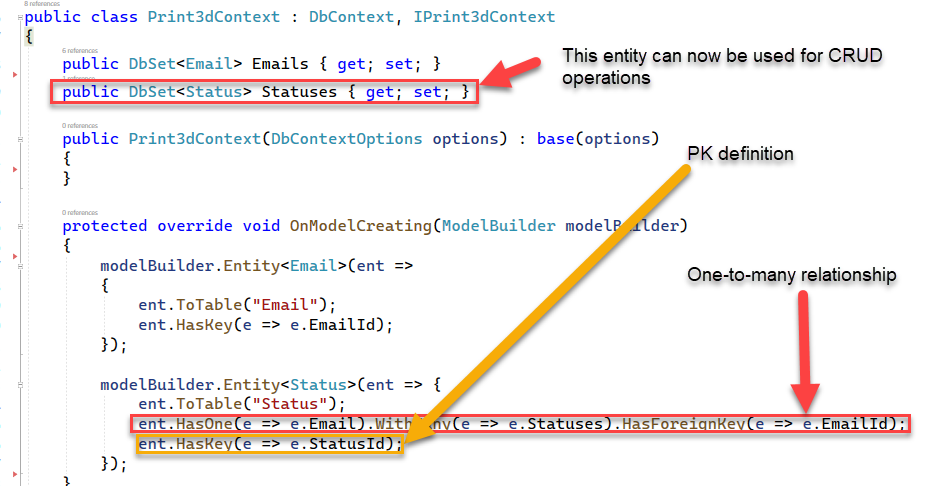

### [[Back to Index]](Index.MD)

## CRUD Operations for Table with Foreign Key Relationship

Setting up CRUD operations for tables with FK relationsips is similar to 
tables with no FK relationship, but there are some important concepts to
understand.

Let's review the steps we did earlier when we created the Email CRUD operations. We 
 will follow the same steps For Status CRUD operations

1. As a review we first created the entity for the status table.
```
namespace BlazorAppDemo.Core.Entities;

public class Status
{
    public int StatusId { get; set; }
    public string Name { get; set; }
    public bool AcceptPayment { get; set; }
    public bool InQueue { get; set; }
    public bool PatronCanDelete { get; set; }
    public bool DisplayOnDashboard { get; set; }
    public bool SubtractInventory { get; set; }
    public bool Completed { get; set; }
    public int? Order { get; set; }
    public DateTime UpdatedAt { get; set; }

    // Status has a list of email
    public int? EmailId { get; set; }
    public virtual Email Email { get; set; }
}
```
* The fields of the Status table are defined with getters and setters.
* To create the FK relationship we define the FK in Status as the same 
name as the primary key in the Email table.
* You must add `public virtual Email Email { get; set; }` to complete 
the FK relationship.

2. Earlier we also created a Model for the Status table. Notice it is almost 
the same as the Entity.
```
namespace BlazorAppDemo.Shared.Print3dModels;

public partial class StatusModel
{
    public int StatusId { get; set; }
    public string Name { get; set; }
    public bool AcceptPayment { get; set; }
    public bool InQueue { get; set; }
    public bool PatronCanDelete { get; set; }
    public bool DisplayOnDashboard { get; set; }
    public bool SubtractInventory { get; set; }
    public bool Completed { get; set; }
    public int? Order { get; set; }
    public DateTime UpdatedAt { get; set; }

    // foreign key relationship
    public int? EmailId { get; set; }
    public virtual EmailModel Email { get; set; }
}

```
3. Create the Mapping in **BlazorAppDemo.Infrastructure.MappingProfile.cs**
```
using AutoMapper;
using BlazorAppDemo.Core.Entities;
using BlazorAppDemo.Shared.Print3dModels;

namespace BlazorAppDemo.Server.BazorAppDemo.Infrastructure;

public class MappingProfile : Profile{
    public MappingProfile()
    {
        CreateMap<Email, EmailModel>().ReverseMap();
        CreateMap<Status, StatusModel>().ReverseMap();

    }
}
```
4. We created **BlazorAppDemo.Cor.Entities.IPrint3dContext.cs earlier. It defines
 the tables that will be available for CRUD operations.

 ```
 using Microsoft.EntityFrameworkCore;

namespace BlazorAppDemo.Core.Entities
{
    public interface IPrint3dContext
    {
        public DbSet<Email> Emails { get; set; }
        public DbSet<Status> Statuses { get; set; }

    }
}
 ```
5. We created the **BlazorAppDemo.Core.Entities.Print3dContext** earlier. It implements **IPrint3dContext**. 
This file is a bridge between entity classes which reside in our application, 
and the database.

 


6. Add a Fluent Validation file titled "StatusValidator.cs" in 
**BlazorAppDemo.Infrastructure.Validators**
```
using BlazorAppDemo.Core.Entities;
using FluentValidation;

namespace Library.Infrastructure.Validators;


public class StatusValidator : AbstractValidator<Status>
{
    public StatusValidator()
    {
        RuleFor(e => e).NotNull().WithMessage("No Status found");
        RuleFor(e => e.Name)
            .NotNull().NotEmpty().WithMessage("Name is required")
            .MaximumLength(255).WithMessage("Name is limited to 255 characters");


    }
}
```
7. We created the **BlazorAppDemo.Core.Interfaces.IPrint3dRepository.cs** earlier in 
 and registered the Db calls.
```
 // Statuses
    Task<List<StatusModel>> GetStatusesAsync();

    Task<List<StatusModel>> GetStatusesByEmailIdAsync(int emailId);

    Task CreateStatusAsync(StatusModel statusModel);

    Task UpdateStatusAsync(StatusModel statusModel);

    Task DeleteStatusAsync(int machineId);
```


8. We created **Blazor.AppDemo.Infrastructure.Repositories.Print3dRepository.cs** 
which holds all of the Db calls earlier. Here we will define the CRUD statements 
 beginning with **GetStatusesAsync()**
```
    public async Task<List<StatusModel>> GetStatusesAsync()
    {
        await using Print3dContext db = await _print3DContext.CreateDbContextAsync();
        List<Status> allStatuses = db.Statuses
            .Include(e => e.Email)
            .OrderBy(e => e.Email.Name)
            .ToList();
        return _mapper.Map<List<StatusModel>>(allStatuses);

    }
```
* Setup the db variable to hold the query
* Populate **allStatuses** with a list of Statuses
* Include the matching Email records (FK records)

9. We need another READ function to retreive only Statuses that match a 
particular EmailId.

```
        public async Task<List<StatusModel>> GetStatusesByEmailIdAsync(int emailId)
        {
            await using Print3dContext db = await _print3DContext.CreateDbContextAsync();
            List<Status> allStatuses =
                db.Statuses
                .Include(e => e.Email)
                .OrderBy(e => e.Email.Name)
                .Where(x => x.EmailId == emailId)
                .ToList();
            return _mapper.Map<List<StatusModel>>(allStatuses);

        }
```
* Create the db variable to hold the query
* Populate **allStatuses** with a list of Statuses filtered by the
emailId which was passed to the function.

10. Update an existing Status record.
```
        await using Print3dContext db = await _print3DContext.CreateDbContextAsync();
        Status statusEntity = _mapper.Map<Status>(updatedStatus);

        // make sure the database entity is valid
        StatusValidator validator = new();
        FluentValidation.Results.ValidationResult validatorResult = await validator.ValidateAsync(statusEntity);

        if (validatorResult.Errors.Any()) // the database entity is not valid
        {
            List<string> valErrors = validatorResult.Errors.Select(v => v.ErrorMessage).ToList();
            throw new Exception(string.Join("; ", valErrors));
        }

        if ( statusEntity.EmailId == 0 )
        {
            statusEntity.EmailId = null;
        } 

        statusEntity.UpdatedAt = System.DateTime.Now;

        db.Statuses.Update(statusEntity);
        await db.SaveChangesAsync();
```
* Create the db variable to hold the query
* Map the value of the status Model back to the status entity.
* Create an instance of the StatusValidator created earlier
* If the data violates any of the validation rules, generate a list of errors
and throw and exception.
* Not all Status codes have an associated Email. If there is not EmailId associated 
with this record, set EmailId to null.
* Set **statusEntity.UpdatedAt** to current date/time
* Pass an UPDATE statement to the database
* Commit the changes to the database


11. Create a new Status Record.

```
        public async Task CreateStatusAsync(StatusModel statusModel)
        {
            await using Print3dContext db = await _print3DContext.CreateDbContextAsync();
            Status statusEntity = _mapper.Map<Status>(statusModel);

            // make sure the database entity is valid
            StatusValidator validator = new();
            FluentValidation.Results.ValidationResult validatorResult = await validator.ValidateAsync(statusEntity);

            if (validatorResult.Errors.Any()) // the database entity is not valid
            {
                List<string> valErrors = validatorResult.Errors.Select(v => v.ErrorMessage).ToList();
                throw new Exception(string.Join("; ", valErrors));
            }

            statusEntity.UpdatedAt = System.DateTime.Now;

            db.Statuses.Add(statusEntity);
            await db.SaveChangesAsync();

        }
```
* Create the db variable to hold the query
* Map the value of the status Model back to the status entity.
* Create an instance of the StatusValidator created earlier
* If the data violates any of the validation rules, generate a list of errors
and throw and exception.
* Set **statusEntity.UpdatedAt** to current date/time
* Pass an INSERT statement to the database
* Commit the changes to the database


