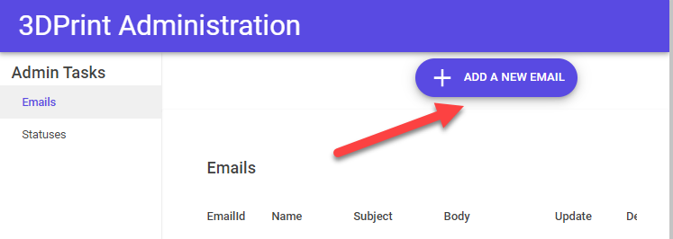
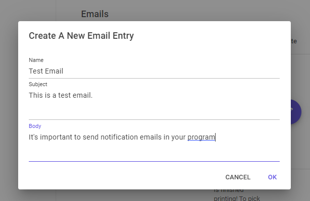
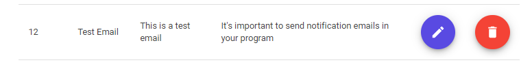
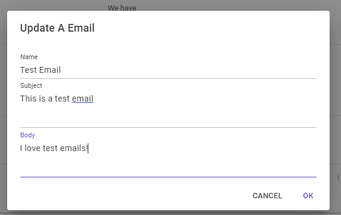
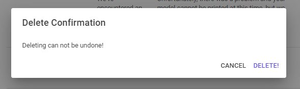
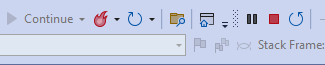

### [[Back to Index]](Index.MD)

## Run The Project

Visual Studio has a built in Webserver you can use to run and test your project

1. Click on the green arrow that has the label of your project.

2. The default web browser for you workstation will launch the program with 
localhost and a port#. This will vary from machine to machine. 

3. Navigate to **https://localhost:7142/Admin/Emails**. This address corresponds to 
"BlazorAppDemo.Shared.Pages.Admin.Emails" on your local machine. The default page to
display in a directory is Index.razor. This page will show you a list of all of your entries
 in the "Email table. Since you don't have any Email entries yet, click on the 
 "Add a New Email" button.

 

4. A dialog box appears. Fill out the form and click "OK"

  

5. You can now see your record in the list.

  

6. Click on the purple edit button and make a change to the record. Then click "OK'

  

7. Click the red delete button to delete the record. You will get a confirmation 
screen. Click the "Delete" text.

  

8. If you are done texting, click the red stop button in Visual Studio.

  

  

