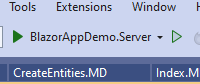
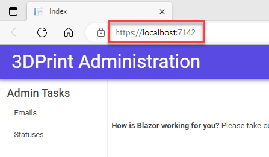

## Run The Project

Visual Studio has a built in Webserver you can use to run and test your project

1. Click on the green arrow that has the label of your project.

2. The default web browser for you workstation will launch the program with 
localhost and a port#. This will vary from machine to machine. 

3. Navigate to 

