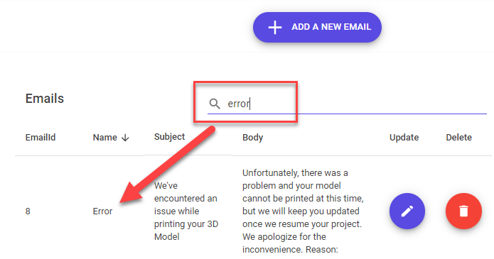

## Search and Filter Function

We can enhance the functionality of our list pages by adding search and filtering capabality. 
We will add these two functions to our Email master/list page.


1. Open the **BlazorAppDemo.Server.Pages.Admin.Emails.Index.razor.cs** file. Add the following lines.
```
private string searchString1 = "";
private EmailModel selectedItem1 = null;
private bool FilterFunc(EmailModel email, string searchString)
private bool FilterFunc1(EmailModel email) => FilterFunc(email, searchString1);

{
    if (string.IsNullOrWhiteSpace(searchString))
        return true;
    if (email.Name.Contains(searchString, StringComparison.OrdinalIgnoreCase))
        return true;
    return false;
}
```
* **searchString1** is bound to a MudTextField and is the string to be searched
* **selectedItem1** is bound to the Filter
* **FilterFunc** 
* **FilterFunc1**
* Test to see if searchString is null
* Test to see if the searchString has a match in the table data

2. Open the **BlazorAppDemo.Server.Pages.Admin.Emails.Index.razor**

3. In the opening **<MudTable> tag, add a **Filter** attribute as show below.
```
<MudTable Class="pa-10" Items="@AllEmails" Filter="new Func<EmailModel, bool>(FilterFunc1)" @bind-SelectedItem="selectedItem1">
```

4. Add **MudTableSortLabel>** tag for each row you wish to sort on as show below.
```
<MudTh Class="mlr-2"><MudTableSortLabel SortBy="new Func<EmailModel, object>(x=>x.EmailId)">EmailId</MudTableSortLabel></MudTh>
<MudTh Class="mlr-2"><MudTableSortLabel SortBy="new Func<EmailModel, object>(x=>x.Name)">Name</MudTableSortLabel></MudTh>
<MudTh Class="mlr-2 d-flex align-items: flex-end;"><MudTableSortLabel SortBy="new Func<EmailModel, object>(x=>x.Subject)">Subject</MudTableSortLabel></MudTh>
<MudTh Class="mlr-2"><MudTableSortLabel SortBy="new Func<EmailModel, object>(x=>x.Body)">Body</MudTableSortLabel></MudTh>
```

5. Below the closing MudTable tag, insert the following.
```
<div class="d-flex flex-wrap mt-4">
    <div style="min-width:200px;">
        <MudText Inline="true" Class="align-self-center"> @selectedItem1?.Name</MudText>
    </div>
</div>
```

6. You can sort by clicking on any column for which sorting is defined. If you click the column
 a second time, the sort direction will reverse. 
 * If you have not yet sorted on a column, when you mouse over it, an arrow will indicate the direction of the sort.
 * If you have clicked a column to sort, an arrow will appear next to the column name indicating the direction the column 
 will sort if you click again.

 

7. To search, enter a term in the search box and press enter. The search will work on any
column where the **<MudTableSortLabel>** defined.

 


