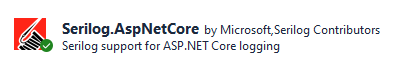

## Implement Serilogs

Serilogs are NuGet package that you can use to implement logging in a Blazor Application.
 We already installed the Serilog NuGet package.



1. Configure Serilogs in ==appsettings.json== as shown below.

```
{
  "Logging": {
    "LogLevel": {
      "Default": "Information",
      "Microsoft.AspNetCore": "Warning"
    }
  },
  "AllowedHosts": "*",
  "Serilog": {
    "Using": [ "Serilog.Sinks.File"],
    "MinimumLevel": {
      "Default": "Debug",
      "Override": {
        "Microsoft": "Error",
        "System": "Information"
      }
    }
  },
    "WriteTo": [
      {
        "Name": "File",
        "Args": {
          "path": "log-txt",
          "rollingInterval": "Day",
          "retainedFileCountLimit": 5,
          "outputTemplate": "{Timestamp:yyyy-MM-dd HH: mm:ss.fff zzz} [{Level}]{NewLine}{Message}{NewLine}{Exception}{NewLine}------------{NewLine}"
        }
      }
    ],
    "Enrich": [ "FromLogCntext", "WithMachineName", "WithExceptionDetails" ]
  }
```
2. Inject the Serilog ILogger service on the page where 
you want to implement Serilogs. For example, in ==BlazorAppDemo.Server.Pages.Admin.Emails.Index.razor.cs==
add the following line above ==protected override async Task OnInitializedAsync()==
```
[Inject] private ILogger<Index> Logger { get; set; }
```
3. Find the ==catch (Exception ex)== statement inside the ==OnInitializedAsync()== function.
 Add the line `Logger.LogError(ex, "Error retreiving Emails");` as shown below.
 ```
 protected override async Task OnInitializedAsync()
    {
        try
        {
            AllEmails = await DataService.GetEmails();
        }
        catch (Exception ex)
        {
            SaveError = $"Error retreiving Emails{ex.Message}";
            Logger.LogError(ex, "Error retreiving Emails");
        }
    }
 ```


 

